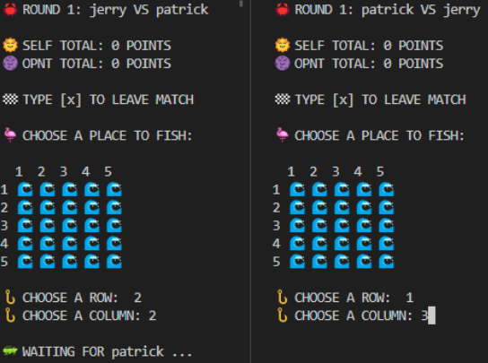
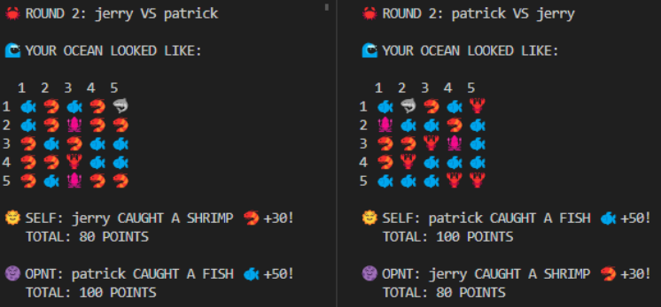
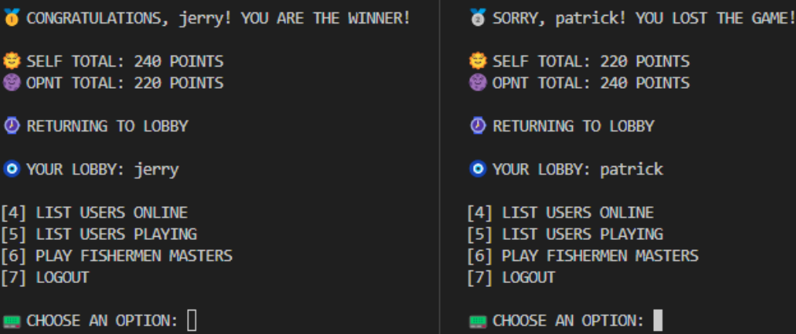

# GAME NETWORKING

### **OVERVIEW**

Hybrid peer-to-peer application to represent an online gaming network, consisting of a server and multiple players. The interaction between the server and users follows a client-server style, while the interaction between players is peer-to-peer.

### **GAME PREVIEW**

---

---

### **GAME DOCUMENTATION**

The complete game documentation, including game interactions explanations and protocols, can be found in the _documentation_ file available in `Portuguese [PT-BR]`.

### **HOW TO RUN**

It is important to note that the interface relies heavily on the emojis present in your operating system and the shell itself for a better experience. We recommend using terminals that support these types of characters, such as VSCode's terminal.

The project is built in Python and is easily executable. First, you need to run the SAI Server in the terminal using the following command:

`python sai_server.py`

Now you can run the clients. In a new terminal, execute the following script located in the root of the project. You can run it in multiple different terminals, each representing a possible connection:

`python user_client.py`

To clean the database and the game.log file, if necessary, you can use the following script:

`python clean_script.py`

### **AUTHOR**

- Giovane Hashinokuti Iwamoto - Computer Science student at UFMS - Brazil - MS
- Paulo Henrique Mendonça Leite - Computer Science student at UFMS - Brazil - MS

I am always open to receiving constructive criticism and suggestions for improvement in my developed code. I believe that feedback is an essential part of the learning and growth process, and I am eager to learn from others and make my code the best it can be. Whether it's a minor tweak or a major overhaul, I am willing to consider all suggestions and implement the changes that will benefit my code and its users.
